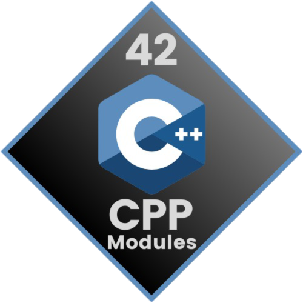

  
  <h2>42 CPP Modules</h2>
    
    
    
    
    
   
<h4>
    <a href="https://github.com/emre-mr246/42_ring4_cpp_modules/issues">❔ Ask a Question</a>
   · 
    <a href="https://github.com/emre-mr246/42_ring4_cpp_modules/issues">🪲 Report Bug</a>
   · 
    <a href="https://github.com/emre-mr246/42_ring4_cpp_modules/issues">💬 Request Feature</a>
</h4>

## Introduction 🚀

This repository contains the first five C++ modules designed for Rank 4, aimed at helping you understand and master the fundamental concepts of the C++ programming language. Each module covers different aspects of C++ programming, including object-oriented programming, memory management, and data structures.

## Included Modules 📚
    Module 00: Namespaces, classes, member functions, streams, initialization lists.
    Module 01: Memory allocation, pointers to members, references, switch statement.
    Module 02: Ad-hoc polymorphism, operator overloading and Orthodox Canonical class form.
    Module 03: Inheritance.
    Module 04: Subtype polymorphism, abstract classes, interfaces.

## Usage ⚙️

1. Navigate to any module directory within the project.

2. Compile the module using the make command:
   `$ make` 

3. You can run the module example with the following command:
   `$ ./module_name`
    
